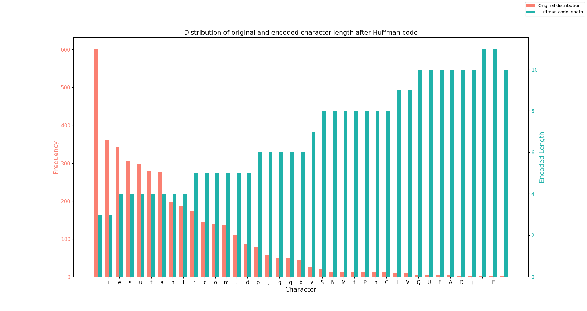

# Huffman encoding

A simple, yet efficient python script for huffman encoding and decoding, with emfasis on visualization and speed.

<i><b>[fig. 1]</b> Example of output plot with a 4000 word Lorem Ipsum as an input</i>
